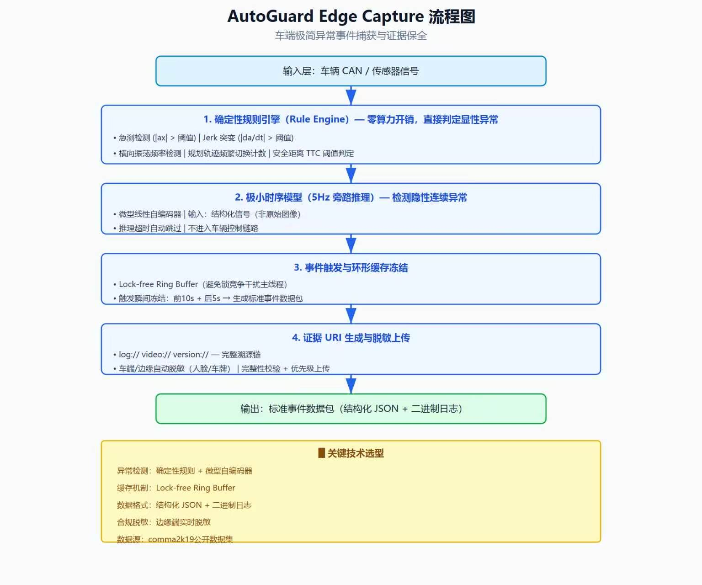

# AutoGuard Edge Capture

面向 L2/L4 车辆的**极简 AI 事件触发器与证据环形缓存**。车端不承担复杂根因诊断，只负责低成本发现疑似异常、冻结事件前后数据，并生成可追溯的标准事件包。

## 核心能力

- 处理 5Hz 结构化信号流；
- 使用确定性安全规则召回异常事件；
- 通过 PCA 等价的微型线性自编码器识别连续行为偏离；
- 使用环形缓存保存异常前后窗口；
- 输出证据 URI，不在车端直接判断“是否由 OTA 导致”。

## 工作流程

<p align="center">
  
</p>

## 快速运行

```bash
python -m venv .venv
source .venv/bin/activate
pip install -e '.[dev]'
python scripts/run_demo.py
uvicorn app:app --reload
```

API：`POST /demo`。

## 公开数据

仓库提供固定官方URL的comma2k19样例下载脚本：

```bash
python scripts/fetch_comma2k19_example.py
```

公开数据只作为真实道路信号来源；演示中的异常由受控实验生成。

## 工程边界

- 参考实现不进入车辆控制链路；
- 生产部署需按目标芯片实测P50/P95/P99延迟、内存、DDR和热负载；
- OOD、行为包络和根因诊断应在云端执行；
- 该项目不是量产安全认证组件。

详见 [SOURCES.md](SOURCES.md)。
